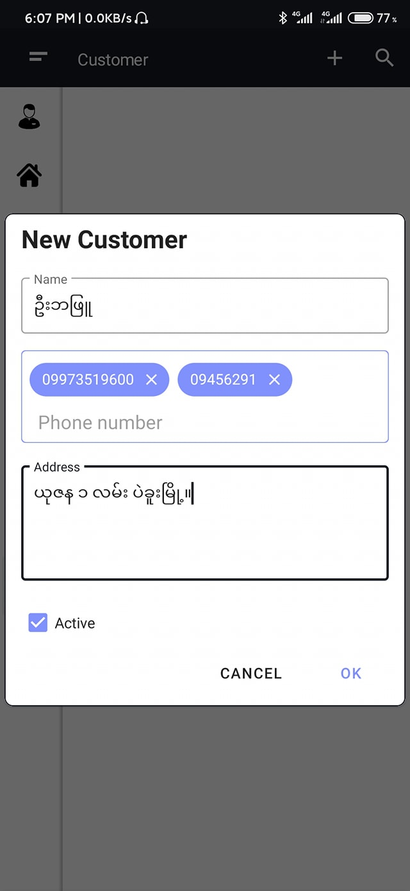

# ATSY POS

That is use for POS in mini shop. App exist two main features. One is client and the last one is server. So, shop owner no need to setup computer to run the server. App can run as a server within local network.

Application has included the following features
- User role
- Adding new category
- Adding new items
- Adding new user
- Adding new customer
- Customer debit amount and repayment money
- Admin can track with the voucher who is selling that ticket
- Admin can see easily out of stock and so on.
    
Demo App
--------
  

Screenshot
----------
  
  This is home page and there is no report data because there has no entry.

  
  This is category page. User can add category with customize color. If there has 20+ data, table will show pagination. UI is small in mobile phone. But, Table will be flexible.

  
  This is adding new product. User can add product with customize color. And then, user can open alert if the stock is lower than 5.

  
  This is adding new product.

  
  This is product list table.

  
  This is employee list table.

  
  This is a navigation drawer menu. This menu depend on login user role.

  
  This is adding new loyal customer.

  
  This is product sell page. After the employee clicked the sell function, firstly he/she will see the category list. 

  
  This is draft voucher list. If there has draft voucher list, the employee can re-open voucher. 

  
  After the employee clicked new voucher, he/she must choose customer name. 

  
  After the employee opened new voucher, he/she can see voucher detail.

  
  The employee can draft if the customer is not finish buying.

  
  The draft voucher support for multiple customers.
  
  
  If the customer doesn't pay full amount, admin can see the customer debt amount in their profile.
  
  
  Admin can see the voucher list and detail of customer.
  
  
  If the customer re-pay debt, their debt amount reduce automatically.
  
  
  This is a dashboard screen. Admin can see the daily report.
  
  
  This is setting page. User can adjust the setting such as voucher header, voucher footer, tax amount, alert amount, font and run as server. 

License
--------

    Copyright 2021 kyawhtut-cu
    
    Licensed under the Apache License, Version 2.0 (the "License");
    you may not use this file except in compliance with the License.
    You may obtain a copy of the License at
    
     http://www.apache.org/licenses/LICENSE-2.0
    
    Unless required by applicable law or agreed to in writing, software
    distributed under the License is distributed on an "AS IS" BASIS,
    WITHOUT WARRANTIES OR CONDITIONS OF ANY KIND, either express or implied.
    See the License for the specific language governing permissions and
    limitations under the License.
